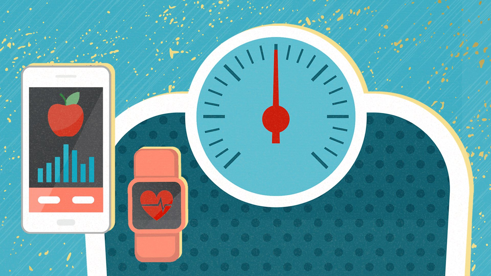

# Health App
## TCC 3141 - Cloud Computing Project (made by Proton miao miao)

  
Table of Contents

  <ol>
    <li><a href="#about-the-project">About The Project</a></li>
    <li><a href="#usage">Usage</a></li>
    <li><a href="#contributing">Contributing</a></li>
    <li><a href="#license">License</a></li>
  </ol>

## About The Project

  

## What is Health App?
<j>Health App is a Body Mass Index(BMI) mobile application according to MIT App Inventor which is to measure the person's weight and height. Also, it can record the BMI every time users calculate their latest BMI. The app can display the charts for the users to show the recorded BMI of users.</j>
